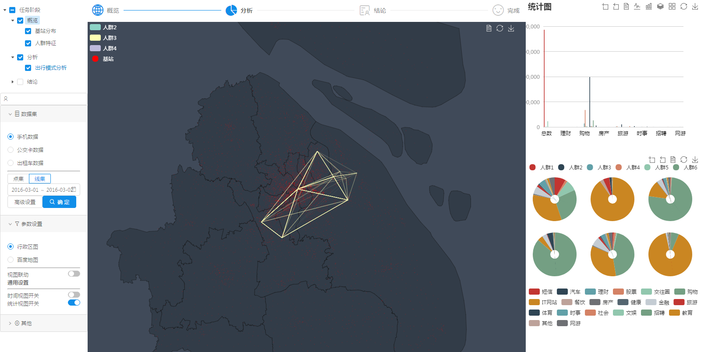

# STAVis

基于React Express Node MongoDB 的时空轨迹可视分析框架

A framework for Visual Analytics of spatio-temporal movement.




## Quickstart

```
  cd your_new_app
  npm install
  npm start
```

**Note : Please make sure your MongoDB is running.** For MongoDB installation guide see [this](https://docs.mongodb.org/v3.0/installation/). Also `npm3` is required to install dependencies properly.

## Available Commands

1. `npm run start` - starts the development server with hot reloading enabled

2. `npm run start-front` - starts the front application without MongoDB server

3. `npm run test` - start the test runner

4. `npm run server` - starts the RESTful API server with MongoDB

## File Structure

### App

Client directory contains all the shared components, routes, modules.

#### components
This folder contains all the common components which are used throughout the project.

#### index.js
Index.js simply does client side rendering using the data provided from `window.__INITIAL_STATE__`.

#### modules
Modules are the way of organising different domain-specific modules in the project. A typical module contains the following

```
| - TrajVA
  | - __tests__ // all the tests for this module goes here
  | - components // Sub components of this module
      | - ControlPanel
          | - index.js  
          | - selectors.js
          | - styles.css
      | - GraphView
      | - MapView
      | - TaskPanel
      | - TimeView
  | - pages // React Router Pages from this module
      | - mainView.js
      | - selectors.js
      | - styles.css
  | - TrajVAActions.js
  | - TrajVAReducer.js
```

### Server

STAVis uses express web framework. Our app sits in server.js where we check for NODE_ENV.

If NODE_ENV is development, we apply Webpack middlewares for bundling and Hot Module Replacement.

### Webpack configs

STAVis uses Webpack for bundling modules. There are three types of Webpack configs provided `webpack.dev.config.js` (for development), `webpack.prod.config.js` (for production), `webpack.base.config.js` (for base configuration in production and development) 


## License
STAVis is under the [MIT License](http://www.opensource.org/licenses/MIT).